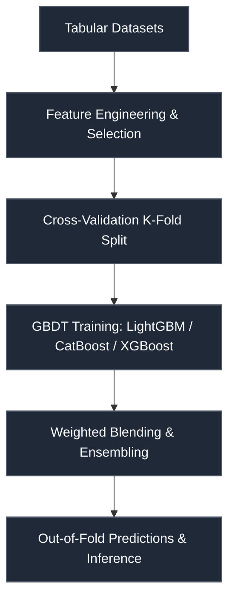

# Hull Tactical — Market Prediction (S&P 500)

 

> **Host:** [`Hull Tactical`]  
> **Platform Link:** [Kaggle Competition](https://www.kaggle.com/competitions/hull-statds-competition-2025)  
> **Dataset Link:** [Kaggle Dataset](https://www.kaggle.com/competitions/hull-statds-competition-2025/data)  
> **Domain:** `Quantitative Finance & Portfolio`

## Overview

This repository contains the developmental workspace and notebooks for the **Hull Tactical — Market Prediction (S&P 500)** project. The primary focus of this project is in the domain of **Quantitative Finance & Portfolio** on Hull Tactical. The codebase represents an iterative implementation of machine learning pipelines, structured to process datasets, train models, and validate predictions.

### Project Context

import matplotlib.pyplot as plt. import numpy as np. from scipy.stats import pearsonr.

### Technical Methodology & Implementation

The codebase features a total of 765 cells across 111 notebook(s). The system implements several key architectural elements:
- **Core Classes**: Custom object-oriented structures are defined to manage state and logic, including: `AdaptiveSignalConverter`, `AdaptiveSignalProcessor`, `AdvancedSignalCalibrator`, `BayesianSignalUpdater`, `DatasetOutput`, `DrawdownController`.
- **Key Algorithms & Utilities**: Procedural helpers and utilities facilitate operations, notably: `ScoreMetric`, `__getitem__`, `__init__`, `__len__`, `__new__`, `__post_init__`, `_build_model`, `_calculate_losses`.
- **Training & Optimization**: Includes optimization via Adam, automated hyperparameter tuning via Optuna, cross-validation strategy for stable predictions.

## System Architecture

## Notebook Architecture

### Preprocessing & EDA

| Notebook / Script | Type | Versions | Average Size | Core Stack / Techniques |
| :--- | :--- | :--- | :--- | :--- |
| **LightGBM_LightGBM_XGBoost_XGBoost_CatBoost_DecisionTree_Preprocessing** | Multi-Version Script | [v1](./Preprocessing%20%26%20EDA/LightGBM_LightGBM_XGBoost_XGBoost_CatBoost_DecisionTree_Preprocessing/v1.ipynb), [v2](./Preprocessing%20%26%20EDA/LightGBM_LightGBM_XGBoost_XGBoost_CatBoost_DecisionTree_Preprocessing/v2.ipynb), [v3](./Preprocessing%20%26%20EDA/LightGBM_LightGBM_XGBoost_XGBoost_CatBoost_DecisionTree_Preprocessing/v3.ipynb), [v4](./Preprocessing%20%26%20EDA/LightGBM_LightGBM_XGBoost_XGBoost_CatBoost_DecisionTree_Preprocessing/v4.ipynb), [v5](./Preprocessing%20%26%20EDA/LightGBM_LightGBM_XGBoost_XGBoost_CatBoost_DecisionTree_Preprocessing/v5.ipynb), [v6](./Preprocessing%20%26%20EDA/LightGBM_LightGBM_XGBoost_XGBoost_CatBoost_DecisionTree_Preprocessing/v6.ipynb) | 125 KB | CatBoost, LightGBM, Optuna Tuning, Scikit-Learn, XGBoost |
| **LightGBM_LightGBM_XGBoost_XGBoost_CatBoost_Preprocessing** | Multi-Version Script | [v1](./Preprocessing%20%26%20EDA/LightGBM_LightGBM_XGBoost_XGBoost_CatBoost_Preprocessing/v1.ipynb), [v2](./Preprocessing%20%26%20EDA/LightGBM_LightGBM_XGBoost_XGBoost_CatBoost_Preprocessing/v2.ipynb) | 30 KB | CatBoost, LightGBM, Scikit-Learn, XGBoost |
| **LightGBM_LightGBM_XGBoost_XGBoost_CatBoost_SVM_DecisionTree_EDA_and_Visualization** | Multi-Version Script | [v1](./Preprocessing%20%26%20EDA/LightGBM_LightGBM_XGBoost_XGBoost_CatBoost_SVM_DecisionTree_EDA_and_Visualization/v1.ipynb), [v2](./Preprocessing%20%26%20EDA/LightGBM_LightGBM_XGBoost_XGBoost_CatBoost_SVM_DecisionTree_EDA_and_Visualization/v2.ipynb), [v3](./Preprocessing%20%26%20EDA/LightGBM_LightGBM_XGBoost_XGBoost_CatBoost_SVM_DecisionTree_EDA_and_Visualization/v3.ipynb), [v4](./Preprocessing%20%26%20EDA/LightGBM_LightGBM_XGBoost_XGBoost_CatBoost_SVM_DecisionTree_EDA_and_Visualization/v4.ipynb), [v5](./Preprocessing%20%26%20EDA/LightGBM_LightGBM_XGBoost_XGBoost_CatBoost_SVM_DecisionTree_EDA_and_Visualization/v5.ipynb) | 1.3 MB | CatBoost, LightGBM, Scikit-Learn, XGBoost |
| **LightGBM_LightGBM_XGBoost_XGBoost_CatBoost_SVM_DecisionTree_Preprocessing** | Multi-Version Script | [v1](./Preprocessing%20%26%20EDA/LightGBM_LightGBM_XGBoost_XGBoost_CatBoost_SVM_DecisionTree_Preprocessing/v1.ipynb), [v2](./Preprocessing%20%26%20EDA/LightGBM_LightGBM_XGBoost_XGBoost_CatBoost_SVM_DecisionTree_Preprocessing/v2.ipynb), [v3](./Preprocessing%20%26%20EDA/LightGBM_LightGBM_XGBoost_XGBoost_CatBoost_SVM_DecisionTree_Preprocessing/v3.ipynb), [v4](./Preprocessing%20%26%20EDA/LightGBM_LightGBM_XGBoost_XGBoost_CatBoost_SVM_DecisionTree_Preprocessing/v4.ipynb), [v5](./Preprocessing%20%26%20EDA/LightGBM_LightGBM_XGBoost_XGBoost_CatBoost_SVM_DecisionTree_Preprocessing/v5.ipynb), [v6](./Preprocessing%20%26%20EDA/LightGBM_LightGBM_XGBoost_XGBoost_CatBoost_SVM_DecisionTree_Preprocessing/v6.ipynb), [v7](./Preprocessing%20%26%20EDA/LightGBM_LightGBM_XGBoost_XGBoost_CatBoost_SVM_DecisionTree_Preprocessing/v7.ipynb) | 42 KB | CatBoost, LightGBM, Scikit-Learn, XGBoost |
| **LightGBM_LightGBM_XGBoost_XGBoost_CatBoost_SVM_DecisionTree_Preprocessing_2** | Multi-Version Script | [v1](./Preprocessing%20%26%20EDA/LightGBM_LightGBM_XGBoost_XGBoost_CatBoost_SVM_DecisionTree_Preprocessing_2/v1.ipynb), [v2](./Preprocessing%20%26%20EDA/LightGBM_LightGBM_XGBoost_XGBoost_CatBoost_SVM_DecisionTree_Preprocessing_2/v2.ipynb) | 56 KB | CatBoost, LightGBM, Scikit-Learn, XGBoost |

### Training

| Notebook / Script | Type | Versions | Average Size | Core Stack / Techniques |
| :--- | :--- | :--- | :--- | :--- |
| [LightGBM_LightGBM_Training](./Training/LightGBM_LightGBM_Training.ipynb) | Single Notebook | v1 | 26 KB | LightGBM, Scikit-Learn |
| **LightGBM_LightGBM_XGBoost_XGBoost_CatBoost_SVM_DecisionTree_Training** | Multi-Version Script | [v1](./Training/LightGBM_LightGBM_XGBoost_XGBoost_CatBoost_SVM_DecisionTree_Training/v1.ipynb), [v2](./Training/LightGBM_LightGBM_XGBoost_XGBoost_CatBoost_SVM_DecisionTree_Training/v2.ipynb), [v3](./Training/LightGBM_LightGBM_XGBoost_XGBoost_CatBoost_SVM_DecisionTree_Training/v3.ipynb), [v4](./Training/LightGBM_LightGBM_XGBoost_XGBoost_CatBoost_SVM_DecisionTree_Training/v4.ipynb), [v5](./Training/LightGBM_LightGBM_XGBoost_XGBoost_CatBoost_SVM_DecisionTree_Training/v5.ipynb) | 28 KB | CatBoost, LightGBM, Scikit-Learn, XGBoost |
| **LightGBM_LightGBM_XGBoost_XGBoost_CatBoost_SVM_DecisionTree_Training_2** | Multi-Version Script | [v1](./Training/LightGBM_LightGBM_XGBoost_XGBoost_CatBoost_SVM_DecisionTree_Training_2/v1.ipynb), [v2](./Training/LightGBM_LightGBM_XGBoost_XGBoost_CatBoost_SVM_DecisionTree_Training_2/v2.ipynb), [v3](./Training/LightGBM_LightGBM_XGBoost_XGBoost_CatBoost_SVM_DecisionTree_Training_2/v3.ipynb), [v4](./Training/LightGBM_LightGBM_XGBoost_XGBoost_CatBoost_SVM_DecisionTree_Training_2/v4.ipynb), [v5](./Training/LightGBM_LightGBM_XGBoost_XGBoost_CatBoost_SVM_DecisionTree_Training_2/v5.ipynb), [v6](./Training/LightGBM_LightGBM_XGBoost_XGBoost_CatBoost_SVM_DecisionTree_Training_2/v6.ipynb), [v7](./Training/LightGBM_LightGBM_XGBoost_XGBoost_CatBoost_SVM_DecisionTree_Training_2/v7.ipynb), [v8](./Training/LightGBM_LightGBM_XGBoost_XGBoost_CatBoost_SVM_DecisionTree_Training_2/v8.ipynb), [v9](./Training/LightGBM_LightGBM_XGBoost_XGBoost_CatBoost_SVM_DecisionTree_Training_2/v9.ipynb), [v10](./Training/LightGBM_LightGBM_XGBoost_XGBoost_CatBoost_SVM_DecisionTree_Training_2/v10.ipynb), [v11](./Training/LightGBM_LightGBM_XGBoost_XGBoost_CatBoost_SVM_DecisionTree_Training_2/v11.ipynb), [v12](./Training/LightGBM_LightGBM_XGBoost_XGBoost_CatBoost_SVM_DecisionTree_Training_2/v12.ipynb), [v13](./Training/LightGBM_LightGBM_XGBoost_XGBoost_CatBoost_SVM_DecisionTree_Training_2/v13.ipynb), [v14](./Training/LightGBM_LightGBM_XGBoost_XGBoost_CatBoost_SVM_DecisionTree_Training_2/v14.ipynb), [v15](./Training/LightGBM_LightGBM_XGBoost_XGBoost_CatBoost_SVM_DecisionTree_Training_2/v15.ipynb) | 51 KB | CatBoost, LightGBM, Scikit-Learn, XGBoost |
| [LightGBM_LightGBM_XGBoost_XGBoost_CatBoost_Training](./Training/LightGBM_LightGBM_XGBoost_XGBoost_CatBoost_Training.ipynb) | Single Notebook | v1 | 61 KB | CatBoost, LightGBM, Scikit-Learn, XGBoost |
| [LightGBM_LightGBM_XGBoost_XGBoost_CatBoost_Training_2](./Training/LightGBM_LightGBM_XGBoost_XGBoost_CatBoost_Training_2.ipynb) | Single Notebook | v1 | 39 KB | CatBoost, LightGBM, Scikit-Learn, XGBoost |
| [LightGBM_LightGBM_XGBoost_XGBoost_CatBoost_Training_3](./Training/LightGBM_LightGBM_XGBoost_XGBoost_CatBoost_Training_3.ipynb) | Single Notebook | v1 | 38 KB | CatBoost, LightGBM, Scikit-Learn, XGBoost |
| [LightGBM_LightGBM_XGBoost_XGBoost_CatBoost_Training_4](./Training/LightGBM_LightGBM_XGBoost_XGBoost_CatBoost_Training_4.ipynb) | Single Notebook | v1 | 48 KB | CatBoost, LightGBM, Scikit-Learn, XGBoost |
| [LightGBM_LightGBM_XGBoost_XGBoost_CatBoost_Training_5](./Training/LightGBM_LightGBM_XGBoost_XGBoost_CatBoost_Training_5.ipynb) | Single Notebook | v1 | 50 KB | CatBoost, LightGBM, PyTorch, Scikit-Learn, XGBoost |
| **LightGBM_LightGBM_XGBoost_XGBoost_CatBoost_Training_6** | Multi-Version Script | [v41](./Training/LightGBM_LightGBM_XGBoost_XGBoost_CatBoost_Training_6/v41.ipynb), [v42](./Training/LightGBM_LightGBM_XGBoost_XGBoost_CatBoost_Training_6/v42.ipynb), [v43](./Training/LightGBM_LightGBM_XGBoost_XGBoost_CatBoost_Training_6/v43.ipynb), [v44](./Training/LightGBM_LightGBM_XGBoost_XGBoost_CatBoost_Training_6/v44.ipynb), [v45](./Training/LightGBM_LightGBM_XGBoost_XGBoost_CatBoost_Training_6/v45.ipynb), [v46](./Training/LightGBM_LightGBM_XGBoost_XGBoost_CatBoost_Training_6/v46.ipynb), [v47](./Training/LightGBM_LightGBM_XGBoost_XGBoost_CatBoost_Training_6/v47.ipynb), [v48](./Training/LightGBM_LightGBM_XGBoost_XGBoost_CatBoost_Training_6/v48.ipynb), [v49](./Training/LightGBM_LightGBM_XGBoost_XGBoost_CatBoost_Training_6/v49.ipynb), [v50](./Training/LightGBM_LightGBM_XGBoost_XGBoost_CatBoost_Training_6/v50.ipynb), [v51](./Training/LightGBM_LightGBM_XGBoost_XGBoost_CatBoost_Training_6/v51.ipynb), [v52](./Training/LightGBM_LightGBM_XGBoost_XGBoost_CatBoost_Training_6/v52.ipynb), [v53](./Training/LightGBM_LightGBM_XGBoost_XGBoost_CatBoost_Training_6/v53.ipynb), [v54](./Training/LightGBM_LightGBM_XGBoost_XGBoost_CatBoost_Training_6/v54.ipynb), [v55](./Training/LightGBM_LightGBM_XGBoost_XGBoost_CatBoost_Training_6/v55.ipynb), [v56](./Training/LightGBM_LightGBM_XGBoost_XGBoost_CatBoost_Training_6/v56.ipynb), [v57](./Training/LightGBM_LightGBM_XGBoost_XGBoost_CatBoost_Training_6/v57.ipynb), [v58](./Training/LightGBM_LightGBM_XGBoost_XGBoost_CatBoost_Training_6/v58.ipynb), [v59](./Training/LightGBM_LightGBM_XGBoost_XGBoost_CatBoost_Training_6/v59.ipynb), [v60](./Training/LightGBM_LightGBM_XGBoost_XGBoost_CatBoost_Training_6/v60.ipynb), [v61](./Training/LightGBM_LightGBM_XGBoost_XGBoost_CatBoost_Training_6/v61.ipynb), [v62](./Training/LightGBM_LightGBM_XGBoost_XGBoost_CatBoost_Training_6/v62.ipynb), [v63](./Training/LightGBM_LightGBM_XGBoost_XGBoost_CatBoost_Training_6/v63.ipynb), [v64](./Training/LightGBM_LightGBM_XGBoost_XGBoost_CatBoost_Training_6/v64.ipynb), [v65](./Training/LightGBM_LightGBM_XGBoost_XGBoost_CatBoost_Training_6/v65.ipynb), [v66](./Training/LightGBM_LightGBM_XGBoost_XGBoost_CatBoost_Training_6/v66.ipynb), [v67](./Training/LightGBM_LightGBM_XGBoost_XGBoost_CatBoost_Training_6/v67.ipynb), [v68](./Training/LightGBM_LightGBM_XGBoost_XGBoost_CatBoost_Training_6/v68.ipynb), [v69](./Training/LightGBM_LightGBM_XGBoost_XGBoost_CatBoost_Training_6/v69.ipynb), [v70](./Training/LightGBM_LightGBM_XGBoost_XGBoost_CatBoost_Training_6/v70.ipynb), [v71](./Training/LightGBM_LightGBM_XGBoost_XGBoost_CatBoost_Training_6/v71.ipynb), [v72](./Training/LightGBM_LightGBM_XGBoost_XGBoost_CatBoost_Training_6/v72.ipynb), [v73](./Training/LightGBM_LightGBM_XGBoost_XGBoost_CatBoost_Training_6/v73.ipynb), [v74](./Training/LightGBM_LightGBM_XGBoost_XGBoost_CatBoost_Training_6/v74.ipynb), [v75](./Training/LightGBM_LightGBM_XGBoost_XGBoost_CatBoost_Training_6/v75.ipynb), [v76](./Training/LightGBM_LightGBM_XGBoost_XGBoost_CatBoost_Training_6/v76.ipynb), [v77](./Training/LightGBM_LightGBM_XGBoost_XGBoost_CatBoost_Training_6/v77.ipynb), [v78](./Training/LightGBM_LightGBM_XGBoost_XGBoost_CatBoost_Training_6/v78.ipynb), [v79](./Training/LightGBM_LightGBM_XGBoost_XGBoost_CatBoost_Training_6/v79.ipynb), [v80](./Training/LightGBM_LightGBM_XGBoost_XGBoost_CatBoost_Training_6/v80.ipynb), [v81](./Training/LightGBM_LightGBM_XGBoost_XGBoost_CatBoost_Training_6/v81.ipynb), [v82](./Training/LightGBM_LightGBM_XGBoost_XGBoost_CatBoost_Training_6/v82.ipynb), [v83](./Training/LightGBM_LightGBM_XGBoost_XGBoost_CatBoost_Training_6/v83.ipynb), [v84](./Training/LightGBM_LightGBM_XGBoost_XGBoost_CatBoost_Training_6/v84.ipynb), [v85](./Training/LightGBM_LightGBM_XGBoost_XGBoost_CatBoost_Training_6/v85.ipynb), [v86](./Training/LightGBM_LightGBM_XGBoost_XGBoost_CatBoost_Training_6/v86.ipynb), [v87](./Training/LightGBM_LightGBM_XGBoost_XGBoost_CatBoost_Training_6/v87.ipynb), [v88](./Training/LightGBM_LightGBM_XGBoost_XGBoost_CatBoost_Training_6/v88.ipynb), [v89](./Training/LightGBM_LightGBM_XGBoost_XGBoost_CatBoost_Training_6/v89.ipynb), [v90](./Training/LightGBM_LightGBM_XGBoost_XGBoost_CatBoost_Training_6/v90.ipynb), [v91](./Training/LightGBM_LightGBM_XGBoost_XGBoost_CatBoost_Training_6/v91.ipynb), [v92](./Training/LightGBM_LightGBM_XGBoost_XGBoost_CatBoost_Training_6/v92.ipynb), [v93](./Training/LightGBM_LightGBM_XGBoost_XGBoost_CatBoost_Training_6/v93.ipynb), [v94](./Training/LightGBM_LightGBM_XGBoost_XGBoost_CatBoost_Training_6/v94.ipynb), [v95](./Training/LightGBM_LightGBM_XGBoost_XGBoost_CatBoost_Training_6/v95.ipynb), [v96](./Training/LightGBM_LightGBM_XGBoost_XGBoost_CatBoost_Training_6/v96.ipynb), [v97](./Training/LightGBM_LightGBM_XGBoost_XGBoost_CatBoost_Training_6/v97.ipynb), [v98](./Training/LightGBM_LightGBM_XGBoost_XGBoost_CatBoost_Training_6/v98.ipynb), [v99](./Training/LightGBM_LightGBM_XGBoost_XGBoost_CatBoost_Training_6/v99.ipynb), [v100](./Training/LightGBM_LightGBM_XGBoost_XGBoost_CatBoost_Training_6/v100.ipynb), [v101](./Training/LightGBM_LightGBM_XGBoost_XGBoost_CatBoost_Training_6/v101.ipynb), [v102](./Training/LightGBM_LightGBM_XGBoost_XGBoost_CatBoost_Training_6/v102.ipynb) | 39 KB | CatBoost, LightGBM, Scikit-Learn, XGBoost |
| [Training](./Training/Training.ipynb) | Single Notebook | v1 | 16 KB | PyTorch, Scikit-Learn |

## Navigation Guidelines

> **Stage Guidelines**
>
- **EDA & Preprocessing**: Verify data loaders and inspect class distributions before model design.
- **Training & Validation**: Check training runs, loss curves, and model validation scores to evaluate performance.
- **Inference & Ensembling**: Run predictions on testing files and verify submission formatting.

---

> "Predicting the market is like mapping the waves during a hurricane."
>
> — **Vigneshwaran S**
