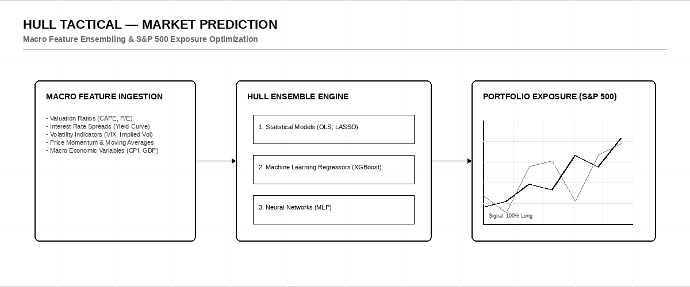

# 💹 Hull Tactical — Market Prediction (S&P 500)

    

> [!IMPORTANT]
> **Host:** `Hull Tactical`  
> **Platform Link:** [Kaggle Competition](https://www.kaggle.com/competitions/hull-statds-competition-2025)  
> **Dataset Link:** [Kaggle Dataset](https://www.kaggle.com/competitions/hull-statds-competition-2025/data)  
> **Domain:** `Quantitative Finance & Portfolio`

## 📖 Overview

Predicting excess S&P 500 returns using macroeconomic indicators. The evaluation is portfolio Sharpe ratio based, so it's a quantitative finance challenge.

## ⚙️ Standard Pipeline Workflow

## 🗂️ Notebook Architecture & Inventory

### 📂 Preprocessing & EDA
*Data cleaning, feature engineering, and exploratory data analysis.*

| Script / Notebook | Type | Versions | Average Size | Core Stack / Techniques |
|:------------------|:-----|:---------|:-------------|:------------------------|
| 📁 **LightGBM_LightGBM_XGBoost_XGBoost_CatBoost_DecisionTree_Preprocessing** | Multi-Version Script | [v1](./Preprocessing%20%26%20EDA/LightGBM_LightGBM_XGBoost_XGBoost_CatBoost_DecisionTree_Preprocessing/v1.ipynb), [v2](./Preprocessing%20%26%20EDA/LightGBM_LightGBM_XGBoost_XGBoost_CatBoost_DecisionTree_Preprocessing/v2.ipynb), [v3](./Preprocessing%20%26%20EDA/LightGBM_LightGBM_XGBoost_XGBoost_CatBoost_DecisionTree_Preprocessing/v3.ipynb), [v4](./Preprocessing%20%26%20EDA/LightGBM_LightGBM_XGBoost_XGBoost_CatBoost_DecisionTree_Preprocessing/v4.ipynb), [v5](./Preprocessing%20%26%20EDA/LightGBM_LightGBM_XGBoost_XGBoost_CatBoost_DecisionTree_Preprocessing/v5.ipynb), [v6](./Preprocessing%20%26%20EDA/LightGBM_LightGBM_XGBoost_XGBoost_CatBoost_DecisionTree_Preprocessing/v6.ipynb) | `Avg 125 KB` | `LightGBM, XGBoost, CatBoost` |
| 📁 **LightGBM_LightGBM_XGBoost_XGBoost_CatBoost_Preprocessing** | Multi-Version Script | [v1](./Preprocessing%20%26%20EDA/LightGBM_LightGBM_XGBoost_XGBoost_CatBoost_Preprocessing/v1.ipynb), [v2](./Preprocessing%20%26%20EDA/LightGBM_LightGBM_XGBoost_XGBoost_CatBoost_Preprocessing/v2.ipynb) | `Avg 29 KB` | `LightGBM, XGBoost, CatBoost` |
| 📁 **LightGBM_LightGBM_XGBoost_XGBoost_CatBoost_SVM_DecisionTree_EDA_and_Visualization** | Multi-Version Script | [v1](./Preprocessing%20%26%20EDA/LightGBM_LightGBM_XGBoost_XGBoost_CatBoost_SVM_DecisionTree_EDA_and_Visualization/v1.ipynb), [v2](./Preprocessing%20%26%20EDA/LightGBM_LightGBM_XGBoost_XGBoost_CatBoost_SVM_DecisionTree_EDA_and_Visualization/v2.ipynb), [v3](./Preprocessing%20%26%20EDA/LightGBM_LightGBM_XGBoost_XGBoost_CatBoost_SVM_DecisionTree_EDA_and_Visualization/v3.ipynb), [v4](./Preprocessing%20%26%20EDA/LightGBM_LightGBM_XGBoost_XGBoost_CatBoost_SVM_DecisionTree_EDA_and_Visualization/v4.ipynb), [v5](./Preprocessing%20%26%20EDA/LightGBM_LightGBM_XGBoost_XGBoost_CatBoost_SVM_DecisionTree_EDA_and_Visualization/v5.ipynb) | `Avg 1369 KB` | `LightGBM, XGBoost, CatBoost` |
| 📁 **LightGBM_LightGBM_XGBoost_XGBoost_CatBoost_SVM_DecisionTree_Preprocessing** | Multi-Version Script | [v1](./Preprocessing%20%26%20EDA/LightGBM_LightGBM_XGBoost_XGBoost_CatBoost_SVM_DecisionTree_Preprocessing/v1.ipynb), [v2](./Preprocessing%20%26%20EDA/LightGBM_LightGBM_XGBoost_XGBoost_CatBoost_SVM_DecisionTree_Preprocessing/v2.ipynb), [v3](./Preprocessing%20%26%20EDA/LightGBM_LightGBM_XGBoost_XGBoost_CatBoost_SVM_DecisionTree_Preprocessing/v3.ipynb), [v4](./Preprocessing%20%26%20EDA/LightGBM_LightGBM_XGBoost_XGBoost_CatBoost_SVM_DecisionTree_Preprocessing/v4.ipynb), [v5](./Preprocessing%20%26%20EDA/LightGBM_LightGBM_XGBoost_XGBoost_CatBoost_SVM_DecisionTree_Preprocessing/v5.ipynb), [v6](./Preprocessing%20%26%20EDA/LightGBM_LightGBM_XGBoost_XGBoost_CatBoost_SVM_DecisionTree_Preprocessing/v6.ipynb), [v7](./Preprocessing%20%26%20EDA/LightGBM_LightGBM_XGBoost_XGBoost_CatBoost_SVM_DecisionTree_Preprocessing/v7.ipynb) | `Avg 41 KB` | `LightGBM, XGBoost, CatBoost` |
| 📁 **LightGBM_LightGBM_XGBoost_XGBoost_CatBoost_SVM_DecisionTree_Preprocessing_2** | Multi-Version Script | [v1](./Preprocessing%20%26%20EDA/LightGBM_LightGBM_XGBoost_XGBoost_CatBoost_SVM_DecisionTree_Preprocessing_2/v1.ipynb), [v2](./Preprocessing%20%26%20EDA/LightGBM_LightGBM_XGBoost_XGBoost_CatBoost_SVM_DecisionTree_Preprocessing_2/v2.ipynb) | `Avg 56 KB` | `LightGBM, XGBoost, CatBoost` |

### 📂 Training
*Model training and tuning scripts.*

| Script / Notebook | Type | Versions | Average Size | Core Stack / Techniques |
|:------------------|:-----|:---------|:-------------|:------------------------|
| 📄 [LightGBM_LightGBM_Training](./Training/LightGBM_LightGBM_Training.ipynb) | Single Notebook | `v1` | `26 KB` | `LightGBM, Scikit-Learn Split` |
| 📁 **LightGBM_LightGBM_XGBoost_XGBoost_CatBoost_SVM_DecisionTree_Training** | Multi-Version Script | [v1](./Training/LightGBM_LightGBM_XGBoost_XGBoost_CatBoost_SVM_DecisionTree_Training/v1.ipynb), [v2](./Training/LightGBM_LightGBM_XGBoost_XGBoost_CatBoost_SVM_DecisionTree_Training/v2.ipynb), [v3](./Training/LightGBM_LightGBM_XGBoost_XGBoost_CatBoost_SVM_DecisionTree_Training/v3.ipynb), [v4](./Training/LightGBM_LightGBM_XGBoost_XGBoost_CatBoost_SVM_DecisionTree_Training/v4.ipynb), [v5](./Training/LightGBM_LightGBM_XGBoost_XGBoost_CatBoost_SVM_DecisionTree_Training/v5.ipynb) | `Avg 27 KB` | `LightGBM, XGBoost, CatBoost` |
| 📁 **LightGBM_LightGBM_XGBoost_XGBoost_CatBoost_SVM_DecisionTree_Training_2** | Multi-Version Script | [v1](./Training/LightGBM_LightGBM_XGBoost_XGBoost_CatBoost_SVM_DecisionTree_Training_2/v1.ipynb), [v10](./Training/LightGBM_LightGBM_XGBoost_XGBoost_CatBoost_SVM_DecisionTree_Training_2/v10.ipynb), [v11](./Training/LightGBM_LightGBM_XGBoost_XGBoost_CatBoost_SVM_DecisionTree_Training_2/v11.ipynb), [v12](./Training/LightGBM_LightGBM_XGBoost_XGBoost_CatBoost_SVM_DecisionTree_Training_2/v12.ipynb), [v13](./Training/LightGBM_LightGBM_XGBoost_XGBoost_CatBoost_SVM_DecisionTree_Training_2/v13.ipynb), [v14](./Training/LightGBM_LightGBM_XGBoost_XGBoost_CatBoost_SVM_DecisionTree_Training_2/v14.ipynb), [v15](./Training/LightGBM_LightGBM_XGBoost_XGBoost_CatBoost_SVM_DecisionTree_Training_2/v15.ipynb), [v2](./Training/LightGBM_LightGBM_XGBoost_XGBoost_CatBoost_SVM_DecisionTree_Training_2/v2.ipynb), [v3](./Training/LightGBM_LightGBM_XGBoost_XGBoost_CatBoost_SVM_DecisionTree_Training_2/v3.ipynb), [v4](./Training/LightGBM_LightGBM_XGBoost_XGBoost_CatBoost_SVM_DecisionTree_Training_2/v4.ipynb), [v5](./Training/LightGBM_LightGBM_XGBoost_XGBoost_CatBoost_SVM_DecisionTree_Training_2/v5.ipynb), [v6](./Training/LightGBM_LightGBM_XGBoost_XGBoost_CatBoost_SVM_DecisionTree_Training_2/v6.ipynb), [v7](./Training/LightGBM_LightGBM_XGBoost_XGBoost_CatBoost_SVM_DecisionTree_Training_2/v7.ipynb), [v8](./Training/LightGBM_LightGBM_XGBoost_XGBoost_CatBoost_SVM_DecisionTree_Training_2/v8.ipynb), [v9](./Training/LightGBM_LightGBM_XGBoost_XGBoost_CatBoost_SVM_DecisionTree_Training_2/v9.ipynb) | `Avg 50 KB` | `LightGBM, XGBoost, CatBoost` |
| 📄 [LightGBM_LightGBM_XGBoost_XGBoost_CatBoost_Training](./Training/LightGBM_LightGBM_XGBoost_XGBoost_CatBoost_Training.ipynb) | Single Notebook | `v1` | `61 KB` | `LightGBM, XGBoost, CatBoost` |
| 📄 [LightGBM_LightGBM_XGBoost_XGBoost_CatBoost_Training_2](./Training/LightGBM_LightGBM_XGBoost_XGBoost_CatBoost_Training_2.ipynb) | Single Notebook | `v1` | `39 KB` | `LightGBM, XGBoost, CatBoost` |
| 📄 [LightGBM_LightGBM_XGBoost_XGBoost_CatBoost_Training_3](./Training/LightGBM_LightGBM_XGBoost_XGBoost_CatBoost_Training_3.ipynb) | Single Notebook | `v1` | `38 KB` | `LightGBM, XGBoost, CatBoost` |
| 📄 [LightGBM_LightGBM_XGBoost_XGBoost_CatBoost_Training_4](./Training/LightGBM_LightGBM_XGBoost_XGBoost_CatBoost_Training_4.ipynb) | Single Notebook | `v1` | `48 KB` | `LightGBM, XGBoost, CatBoost` |
| 📄 [LightGBM_LightGBM_XGBoost_XGBoost_CatBoost_Training_5](./Training/LightGBM_LightGBM_XGBoost_XGBoost_CatBoost_Training_5.ipynb) | Single Notebook | `v1` | `50 KB` | `LightGBM, XGBoost, CatBoost` |
| 📁 **LightGBM_LightGBM_XGBoost_XGBoost_CatBoost_Training_6** | Multi-Version Script | [v1](./Training/LightGBM_LightGBM_XGBoost_XGBoost_CatBoost_Training_6/v1.ipynb), [v10](./Training/LightGBM_LightGBM_XGBoost_XGBoost_CatBoost_Training_6/v10.ipynb), [v100](./Training/LightGBM_LightGBM_XGBoost_XGBoost_CatBoost_Training_6/v100.ipynb), [v101](./Training/LightGBM_LightGBM_XGBoost_XGBoost_CatBoost_Training_6/v101.ipynb), [v102](./Training/LightGBM_LightGBM_XGBoost_XGBoost_CatBoost_Training_6/v102.ipynb), [v11](./Training/LightGBM_LightGBM_XGBoost_XGBoost_CatBoost_Training_6/v11.ipynb), [v12](./Training/LightGBM_LightGBM_XGBoost_XGBoost_CatBoost_Training_6/v12.ipynb), [v13](./Training/LightGBM_LightGBM_XGBoost_XGBoost_CatBoost_Training_6/v13.ipynb), [v14](./Training/LightGBM_LightGBM_XGBoost_XGBoost_CatBoost_Training_6/v14.ipynb), [v15](./Training/LightGBM_LightGBM_XGBoost_XGBoost_CatBoost_Training_6/v15.ipynb), [v16](./Training/LightGBM_LightGBM_XGBoost_XGBoost_CatBoost_Training_6/v16.ipynb), [v17](./Training/LightGBM_LightGBM_XGBoost_XGBoost_CatBoost_Training_6/v17.ipynb), [v18](./Training/LightGBM_LightGBM_XGBoost_XGBoost_CatBoost_Training_6/v18.ipynb), [v19](./Training/LightGBM_LightGBM_XGBoost_XGBoost_CatBoost_Training_6/v19.ipynb), [v2](./Training/LightGBM_LightGBM_XGBoost_XGBoost_CatBoost_Training_6/v2.ipynb), [v20](./Training/LightGBM_LightGBM_XGBoost_XGBoost_CatBoost_Training_6/v20.ipynb), [v21](./Training/LightGBM_LightGBM_XGBoost_XGBoost_CatBoost_Training_6/v21.ipynb), [v22](./Training/LightGBM_LightGBM_XGBoost_XGBoost_CatBoost_Training_6/v22.ipynb), [v23](./Training/LightGBM_LightGBM_XGBoost_XGBoost_CatBoost_Training_6/v23.ipynb), [v24](./Training/LightGBM_LightGBM_XGBoost_XGBoost_CatBoost_Training_6/v24.ipynb), [v25](./Training/LightGBM_LightGBM_XGBoost_XGBoost_CatBoost_Training_6/v25.ipynb), [v26](./Training/LightGBM_LightGBM_XGBoost_XGBoost_CatBoost_Training_6/v26.ipynb), [v27](./Training/LightGBM_LightGBM_XGBoost_XGBoost_CatBoost_Training_6/v27.ipynb), [v28](./Training/LightGBM_LightGBM_XGBoost_XGBoost_CatBoost_Training_6/v28.ipynb), [v29](./Training/LightGBM_LightGBM_XGBoost_XGBoost_CatBoost_Training_6/v29.ipynb), [v3](./Training/LightGBM_LightGBM_XGBoost_XGBoost_CatBoost_Training_6/v3.ipynb), [v30](./Training/LightGBM_LightGBM_XGBoost_XGBoost_CatBoost_Training_6/v30.ipynb), [v31](./Training/LightGBM_LightGBM_XGBoost_XGBoost_CatBoost_Training_6/v31.ipynb), [v32](./Training/LightGBM_LightGBM_XGBoost_XGBoost_CatBoost_Training_6/v32.ipynb), [v33](./Training/LightGBM_LightGBM_XGBoost_XGBoost_CatBoost_Training_6/v33.ipynb), [v34](./Training/LightGBM_LightGBM_XGBoost_XGBoost_CatBoost_Training_6/v34.ipynb), [v35](./Training/LightGBM_LightGBM_XGBoost_XGBoost_CatBoost_Training_6/v35.ipynb), [v36](./Training/LightGBM_LightGBM_XGBoost_XGBoost_CatBoost_Training_6/v36.ipynb), [v37](./Training/LightGBM_LightGBM_XGBoost_XGBoost_CatBoost_Training_6/v37.ipynb), [v38](./Training/LightGBM_LightGBM_XGBoost_XGBoost_CatBoost_Training_6/v38.ipynb), [v39](./Training/LightGBM_LightGBM_XGBoost_XGBoost_CatBoost_Training_6/v39.ipynb), [v4](./Training/LightGBM_LightGBM_XGBoost_XGBoost_CatBoost_Training_6/v4.ipynb), [v40](./Training/LightGBM_LightGBM_XGBoost_XGBoost_CatBoost_Training_6/v40.ipynb), [v41](./Training/LightGBM_LightGBM_XGBoost_XGBoost_CatBoost_Training_6/v41.ipynb), [v42](./Training/LightGBM_LightGBM_XGBoost_XGBoost_CatBoost_Training_6/v42.ipynb), [v43](./Training/LightGBM_LightGBM_XGBoost_XGBoost_CatBoost_Training_6/v43.ipynb), [v44](./Training/LightGBM_LightGBM_XGBoost_XGBoost_CatBoost_Training_6/v44.ipynb), [v45](./Training/LightGBM_LightGBM_XGBoost_XGBoost_CatBoost_Training_6/v45.ipynb), [v46](./Training/LightGBM_LightGBM_XGBoost_XGBoost_CatBoost_Training_6/v46.ipynb), [v47](./Training/LightGBM_LightGBM_XGBoost_XGBoost_CatBoost_Training_6/v47.ipynb), [v48](./Training/LightGBM_LightGBM_XGBoost_XGBoost_CatBoost_Training_6/v48.ipynb), [v49](./Training/LightGBM_LightGBM_XGBoost_XGBoost_CatBoost_Training_6/v49.ipynb), [v5](./Training/LightGBM_LightGBM_XGBoost_XGBoost_CatBoost_Training_6/v5.ipynb), [v50](./Training/LightGBM_LightGBM_XGBoost_XGBoost_CatBoost_Training_6/v50.ipynb), [v51](./Training/LightGBM_LightGBM_XGBoost_XGBoost_CatBoost_Training_6/v51.ipynb), [v52](./Training/LightGBM_LightGBM_XGBoost_XGBoost_CatBoost_Training_6/v52.ipynb), [v53](./Training/LightGBM_LightGBM_XGBoost_XGBoost_CatBoost_Training_6/v53.ipynb), [v54](./Training/LightGBM_LightGBM_XGBoost_XGBoost_CatBoost_Training_6/v54.ipynb), [v55](./Training/LightGBM_LightGBM_XGBoost_XGBoost_CatBoost_Training_6/v55.ipynb), [v56](./Training/LightGBM_LightGBM_XGBoost_XGBoost_CatBoost_Training_6/v56.ipynb), [v57](./Training/LightGBM_LightGBM_XGBoost_XGBoost_CatBoost_Training_6/v57.ipynb), [v58](./Training/LightGBM_LightGBM_XGBoost_XGBoost_CatBoost_Training_6/v58.ipynb), [v59](./Training/LightGBM_LightGBM_XGBoost_XGBoost_CatBoost_Training_6/v59.ipynb), [v6](./Training/LightGBM_LightGBM_XGBoost_XGBoost_CatBoost_Training_6/v6.ipynb), [v60](./Training/LightGBM_LightGBM_XGBoost_XGBoost_CatBoost_Training_6/v60.ipynb), [v61](./Training/LightGBM_LightGBM_XGBoost_XGBoost_CatBoost_Training_6/v61.ipynb), [v62](./Training/LightGBM_LightGBM_XGBoost_XGBoost_CatBoost_Training_6/v62.ipynb), [v63](./Training/LightGBM_LightGBM_XGBoost_XGBoost_CatBoost_Training_6/v63.ipynb), [v64](./Training/LightGBM_LightGBM_XGBoost_XGBoost_CatBoost_Training_6/v64.ipynb), [v65](./Training/LightGBM_LightGBM_XGBoost_XGBoost_CatBoost_Training_6/v65.ipynb), [v66](./Training/LightGBM_LightGBM_XGBoost_XGBoost_CatBoost_Training_6/v66.ipynb), [v67](./Training/LightGBM_LightGBM_XGBoost_XGBoost_CatBoost_Training_6/v67.ipynb), [v68](./Training/LightGBM_LightGBM_XGBoost_XGBoost_CatBoost_Training_6/v68.ipynb), [v69](./Training/LightGBM_LightGBM_XGBoost_XGBoost_CatBoost_Training_6/v69.ipynb), [v7](./Training/LightGBM_LightGBM_XGBoost_XGBoost_CatBoost_Training_6/v7.ipynb), [v70](./Training/LightGBM_LightGBM_XGBoost_XGBoost_CatBoost_Training_6/v70.ipynb), [v71](./Training/LightGBM_LightGBM_XGBoost_XGBoost_CatBoost_Training_6/v71.ipynb), [v72](./Training/LightGBM_LightGBM_XGBoost_XGBoost_CatBoost_Training_6/v72.ipynb), [v73](./Training/LightGBM_LightGBM_XGBoost_XGBoost_CatBoost_Training_6/v73.ipynb), [v74](./Training/LightGBM_LightGBM_XGBoost_XGBoost_CatBoost_Training_6/v74.ipynb), [v75](./Training/LightGBM_LightGBM_XGBoost_XGBoost_CatBoost_Training_6/v75.ipynb), [v76](./Training/LightGBM_LightGBM_XGBoost_XGBoost_CatBoost_Training_6/v76.ipynb), [v77](./Training/LightGBM_LightGBM_XGBoost_XGBoost_CatBoost_Training_6/v77.ipynb), [v78](./Training/LightGBM_LightGBM_XGBoost_XGBoost_CatBoost_Training_6/v78.ipynb), [v79](./Training/LightGBM_LightGBM_XGBoost_XGBoost_CatBoost_Training_6/v79.ipynb), [v8](./Training/LightGBM_LightGBM_XGBoost_XGBoost_CatBoost_Training_6/v8.ipynb), [v80](./Training/LightGBM_LightGBM_XGBoost_XGBoost_CatBoost_Training_6/v80.ipynb), [v81](./Training/LightGBM_LightGBM_XGBoost_XGBoost_CatBoost_Training_6/v81.ipynb), [v82](./Training/LightGBM_LightGBM_XGBoost_XGBoost_CatBoost_Training_6/v82.ipynb), [v83](./Training/LightGBM_LightGBM_XGBoost_XGBoost_CatBoost_Training_6/v83.ipynb), [v84](./Training/LightGBM_LightGBM_XGBoost_XGBoost_CatBoost_Training_6/v84.ipynb), [v85](./Training/LightGBM_LightGBM_XGBoost_XGBoost_CatBoost_Training_6/v85.ipynb), [v86](./Training/LightGBM_LightGBM_XGBoost_XGBoost_CatBoost_Training_6/v86.ipynb), [v87](./Training/LightGBM_LightGBM_XGBoost_XGBoost_CatBoost_Training_6/v87.ipynb), [v88](./Training/LightGBM_LightGBM_XGBoost_XGBoost_CatBoost_Training_6/v88.ipynb), [v89](./Training/LightGBM_LightGBM_XGBoost_XGBoost_CatBoost_Training_6/v89.ipynb), [v9](./Training/LightGBM_LightGBM_XGBoost_XGBoost_CatBoost_Training_6/v9.ipynb), [v90](./Training/LightGBM_LightGBM_XGBoost_XGBoost_CatBoost_Training_6/v90.ipynb), [v91](./Training/LightGBM_LightGBM_XGBoost_XGBoost_CatBoost_Training_6/v91.ipynb), [v92](./Training/LightGBM_LightGBM_XGBoost_XGBoost_CatBoost_Training_6/v92.ipynb), [v93](./Training/LightGBM_LightGBM_XGBoost_XGBoost_CatBoost_Training_6/v93.ipynb), [v94](./Training/LightGBM_LightGBM_XGBoost_XGBoost_CatBoost_Training_6/v94.ipynb), [v95](./Training/LightGBM_LightGBM_XGBoost_XGBoost_CatBoost_Training_6/v95.ipynb), [v96](./Training/LightGBM_LightGBM_XGBoost_XGBoost_CatBoost_Training_6/v96.ipynb), [v97](./Training/LightGBM_LightGBM_XGBoost_XGBoost_CatBoost_Training_6/v97.ipynb), [v98](./Training/LightGBM_LightGBM_XGBoost_XGBoost_CatBoost_Training_6/v98.ipynb), [v99](./Training/LightGBM_LightGBM_XGBoost_XGBoost_CatBoost_Training_6/v99.ipynb) | `Avg 33 KB` | `LightGBM, CatBoost, Scikit-Learn Split` |
| 📄 [Training](./Training/Training.ipynb) | Single Notebook | `v1` | `16 KB` | `PyTorch, Scikit-Learn Split` |

---

## 🚀 Navigation & Usage Guidelines

> [!TIP]
> 1. **EDA & Preprocessing**: Verify data loaders, actigraphy or DICOM image transformations before model training.
> 2. **Training & Optimization**: Check model definition parameters and training logs to reproduce network weights.
> 3. **Inference & Post-Processing**: Run final pipelines to verify predictions and check submission formats.

---

> *"Predicting the market is like mapping the waves during a hurricane."*
>
> — **Vigneshwaran S**
